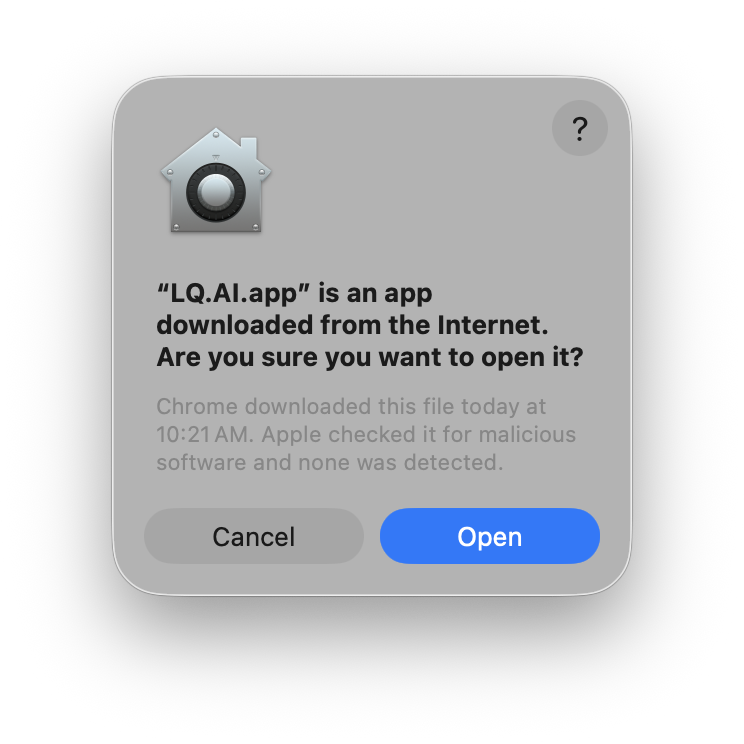
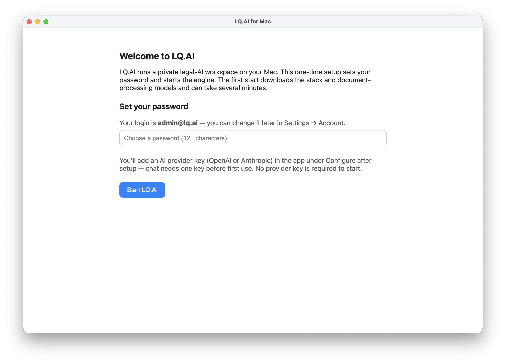
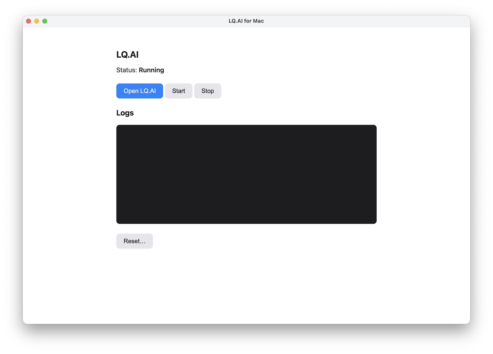
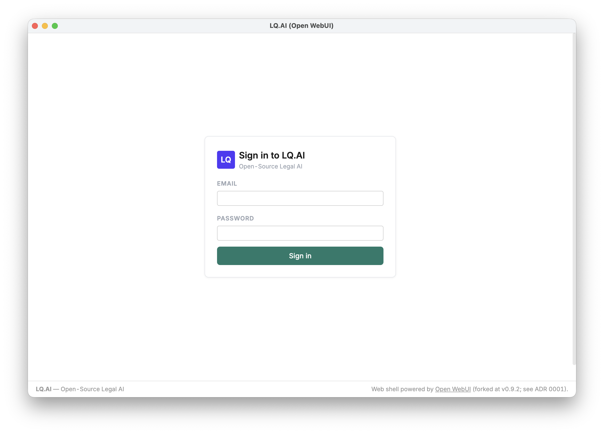
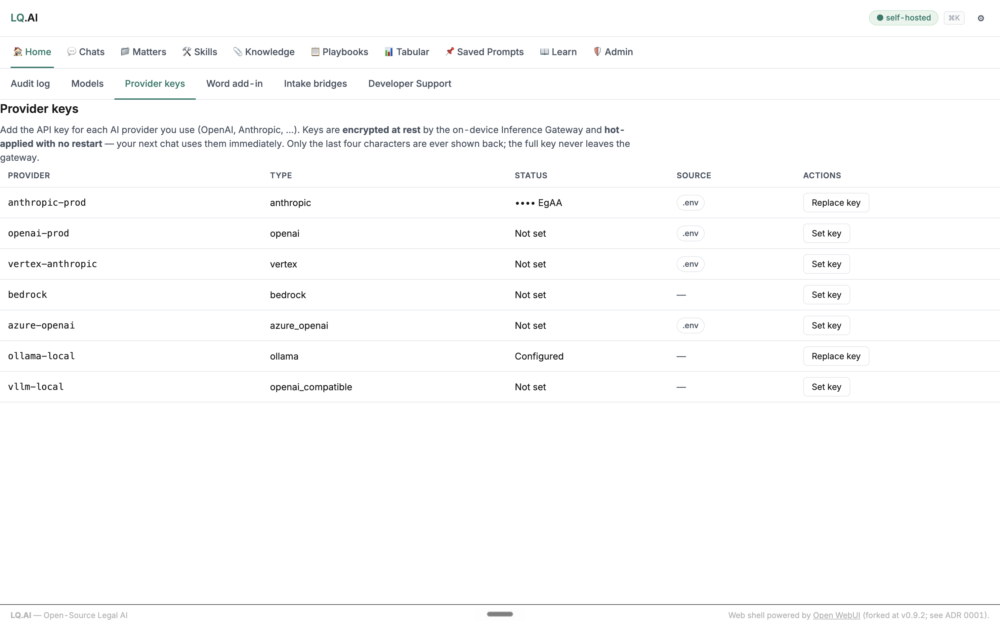
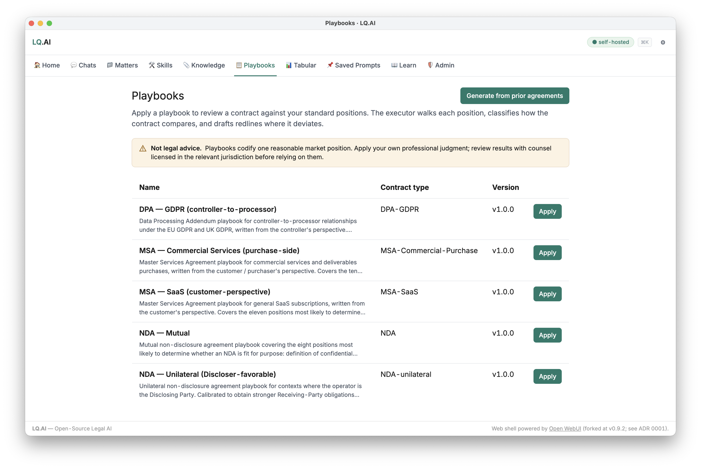

# Install on macOS

The Mac desktop app installs LQ.AI as a one-app, Docker-based install you run from a control panel — download it, open it, set a password, and you're working, with **no terminal, no GitHub, and no config files** to edit.

Everything LQ.AI does runs **locally on your Mac**. Your documents never leave your computer unless you add a cloud AI provider key and choose a cloud model.

---

## What you need

- A **Mac with Apple Silicon** (M1/M2/M3/M4).
- **Docker Desktop** installed and running — LQ.AI uses it to run its engine on your machine.
  **[Download Docker Desktop for Apple Silicon →](https://desktop.docker.com/mac/main/arm64/Docker.dmg)**
  (or browse [docker.com/products/docker-desktop](https://www.docker.com/products/docker-desktop/)).
  If Docker isn't installed or running, LQ.AI tells you and links you to it.
- **About 12 GB of free disk** for the engine images, and an internet connection for the first run.
  Leave room beyond that for the document-processing models and whatever documents you upload.

## Download and check the release

Go to the **latest desktop release** on the
[LQ.AI Releases page](https://github.com/LegalQuants/lq-ai/releases) and download the
**`LQ.AI-<version>-arm64.dmg`**.

Before you drag the app to Applications, you can check that what you downloaded is the real,
signed release: the app is signed and notarized by Apple (Developer ID: Tucuxi, Inc.) — see
[Install and set up](#install-and-set-up), below — and that's checkable rather than merely
asserted. This is the same check the maintainer runs by hand against the published artifact
([`docs/BUILD-AND-RELEASE.md`](BUILD-AND-RELEASE.md) records it precisely because a green CI run
is not proof the shipped `.dmg` is signed and stapled):

```bash
gh release download desktop-vX.Y.Z -R LegalQuants/lq-ai -p '*.dmg' -D /tmp --clobber
spctl -a -vvv -t open --context context:primary-signature /tmp/LQ.AI-*.dmg
#   want: accepted / source=Notarized Developer ID / origin=Developer ID Application: Tucuxi, Inc. (MC8BT9Z8GD)
xcrun stapler validate /tmp/LQ.AI-*.dmg     # "The validate action worked!"
```

A `Rejected` verdict, or a `stapler validate` that doesn't report success, tells you that the file
in front of you is not the signed and stapled artifact the maintainer verified — it doesn't by
itself say why. The cause can sit on either side: an altered or incomplete download, or a release
that shipped without one of the two steps ([`docs/BUILD-AND-RELEASE.md`](BUILD-AND-RELEASE.md)
records that a `.dmg` needs both the signature and the staple). Don't proceed past a failed check:
download the file again from the
[Releases page](https://github.com/LegalQuants/lq-ai/releases), re-run both commands, and if it
still fails, treat it as a release problem to report rather than a warning to click through. Most
people can skip this and rely on macOS Gatekeeper's own check in the next step; run it yourself if
you want the same proof the release maintainer checks.

## Install and set up

Double-click the downloaded `.dmg`. A window opens — **drag the LQ.AI icon onto the Applications
folder**, then eject the disk image.


*The opened `.dmg` — drag **LQ.AI.app** onto **Applications**, then eject the disk image.*

Open LQ.AI from your **Applications** folder (or Launchpad). Because the app is **signed and
notarized by Apple** (Developer ID: Tucuxi, Inc.), it opens normally — no "unidentified developer"
warning.



*Because the app is signed + notarized (Apple Developer ID), macOS confirms it **checked the app and found no malicious software** — click **Open**.*

The first time you open LQ.AI, a short **Welcome** wizard appears:

<!-- TODO: regenerate launcher-wizard.png to show the optional provider-key field (added 2026-06-21). -->


*The one-time setup wizard — set a password for `admin@lq.ai`, optionally paste an AI provider key, and click **Start LQ.AI**.*

- **Set your password.** Your login is **`admin@lq.ai`** (shown on screen); choose a password of at
  least 12 characters. You can change the email and password later in **Settings → Account**.
- **AI provider key (optional).** Paste an **Anthropic** (`sk-ant-…`) or **OpenAI** key so chat works
  the moment you sign in. The provider is detected automatically from the key. You can leave this blank
  to start — the engine runs fine without it — and add a key later (see Provider keys (BYOK), below).

Use this wizard for the desktop install — the source-clone commands in the Compose Quick Start are
a different route (see [Prefer the command line?](#prefer-the-command-line) at the end of this
page).

## First start and sign-in

Click **Start LQ.AI**. The first start **downloads the engine and document-processing models** — a few
minutes the first time only — and shows live progress (e.g. *"5/8 services ready"*). When it reaches
**Running**, you're set.

> [!NOTE]
> **The provider-key field is optional.** The stack boots fully healthy with no provider key at
> all — but chat can't answer until a key is present, either from this field or added in-app later.

> [!NOTE]
> **Those first-run downloads aren't the chat model.** They're LQ.AI's **document-reading models**
> (search, highlighting, document structure) — not the chat AI. You don't have to wait for them to
> finish to sign in; they keep loading in the background and only matter when you upload documents.
> They do not add OCR: LQ.AI reads the text layer of a PDF, so a scanned or image-only PDF with no
> extractable text is not yet supported.



*Once the stack is healthy the panel shows **Running** — click **Open LQ.AI**.*

Click **Open LQ.AI** and sign in with **`admin@lq.ai`** and the password you set. You'll land on the
home workspace. A working sign-in only means the app itself is running — chat additionally needs a
provider key before it can answer (first note above), and the document-processing models keep
loading passively in the background regardless (second note above).



*Sign in with `admin@lq.ai` and the password you set in setup.*


*The Home screen after you log in — everything runs on your Mac (note the **self-hosted** badge). The Featured Tools grid is your jumping-off point: Enhance Prompt, Skill Creator, Knowledge, Playbooks, Tabular Review, Apply a Skill, and Autonomous.*

## 5. Provider keys (BYOK)

LQ.AI is **bring-your-own-key**: chat and skills call AI providers (OpenAI, Anthropic, …) using **your**
API key. **The stack runs without a key, but chat will not answer until one is present.** There are two
ways to supply one — use whichever fits:

**A. In the setup wizard (easiest).** If you pasted a key during setup, you're already done — chat
works as soon as you sign in. Skip the rest of this section.

**B. In the app, any time after launch.** Add, replace, or revoke keys from the admin **Provider keys**
page — useful if you skipped the wizard field, want to add a second provider, or need to rotate a key.


*Until a provider key is present, a new chat shows **"no provider · default"**. Add one on the **Provider keys** page and it's hot-applied (no restart).*

To add a key in the app:

1. Open the admin area and go to **Provider keys**.
2. Find your provider (e.g. `anthropic-prod` or `openai-prod`) and click **Set key**.
3. Paste the key and **Save**. It's **encrypted at rest** and **hot-applied with no restart** — your next
   chat uses it immediately. Only the last four characters are ever shown back.



*The **Admin → Provider keys** page. A key set in the setup wizard shows source **`.env`**; a key added here is stored **encrypted in the gateway** (source **runtime**) and can be revoked in place. Only the last four characters are ever shown.*

Your provider keys are held by the engine's Inference Gateway on your Mac and never leave it; the launcher
stores a key only in the local `.env` (wizard path) or encrypted in the gateway (in-app path).

---

## Everyday use

The LQ.AI app window is your **control panel**:

- **Open LQ.AI** — opens the workspace (once the engine is Running).
- **Start / Stop** — start or stop the engine. Stopping frees up your Mac's resources; your data is
  kept and is there next time you Start.
- **Logs** — a live view of what the engine is doing, handy if something looks stuck.
- **Reset…** — erases all LQ.AI data on this Mac and re-runs first-time setup (two clicks to confirm).
  Use this only if you want to start completely fresh.

Inside the workspace, the Featured Tools are where the work happens — apply a **Skill** to a document,
build a **Knowledge** base, run **Tabular Review** across many files, or check a contract against your
standard positions with a **Playbook**:



*For example, **Playbooks** — review a contract against your standard positions; each position is classified and redlined.*

Because LQ.AI is self-hosted, it's also fully auditable: every state-changing action is recorded.


*Every state-changing action is written to the **Admin → Audit log** — self-hosted and fully auditable.*

You can quit the app when you're done. Re-opening goes straight to the control panel — the setup wizard
only runs the very first time.

## Where the desktop settings live

The launcher's own state — an encrypted `config.enc` plus a chmod-600 `.env` — lives at
`~/Library/Application Support/lq-ai-desktop/`. The bundled compose file it runs is
`/Applications/LQ.AI.app/Contents/Resources/docker-compose.release.yml`.

That directory is not where your data lives, though. Your chats, files and audit log live in the
Docker named volumes the launcher's compose project creates — `pgdata`, `redisdata`, `miniodata`,
`lq-ai-ops`, `gateway-config`, `ingest-hf-cache`, `ingest-easyocr-cache`
(`docker-compose.release.yml`) — which Docker holds, not that directory. A backup plan for this
install path has to cover both; see [Backup and restore](operate/backup-and-restore.md).

## If startup stalls

- **"Docker is not running."** Start **Docker Desktop** (the whale icon in your menu bar), wait until it
  says *Running*, then click **Start** in LQ.AI.
- **First start is slow.** Normal — the engine images and document models download once. Watch the live
  progress; you can sign in as soon as it says **Running**.
- **Chat says it has no model / fails to answer.** You haven't added a provider key yet — add one in
  **Provider keys (BYOK)**, above. Chat needs at least one provider key.

## The desktop release and engine versions are separate

One thing worth knowing before you rely on this for anything beyond evaluation: the app and the
engine are two release lines. A release build of the launcher bakes in the engine image tag
matching its own version (`desktop-vX.Y.Z` → `LQ_AI_IMAGE_TAG=vX.Y.Z`), writes it into the
generated `.env`, and realigns it on each launcher upgrade; only a locally built launcher falls
back to `latest` ([`docs/BUILD-AND-RELEASE.md`](BUILD-AND-RELEASE.md)). But the `spctl` and
`stapler` checks above vouch for the `.dmg` only — not for the api, gateway, web and proxy images
it then pulls, which the release compose file references by tag rather than by digest
(`docker-compose.release.yml`). When you report a problem or need a repeatable install, record the
launcher version and the `LQ_AI_IMAGE_TAG` from that `.env` together, and the image digests Docker
resolved it to if you need byte-for-byte reproducibility.

## How this install relates to the Docker Compose install

This app wraps `docker-compose.release.yml`, which runs the same eight services as the Docker
Compose install plus a ninth, `proxy` (`lq-ai-proxy`), that puts the web shell and the api on one
origin and owns the user-facing port. That means the two installs share most of their operational
surface underneath — the same data in Postgres/RustFS, the same `reset-admin-password` escape hatch
below — but the release stack fronts everything through that proxy instead of exposing `web`
directly.

## Password recovery without a reset

Forgot your password? It doesn't need the launcher's destructive **Reset…** control above, which
erases the stack's volumes and re-runs first-time setup — your data is untouched by the command
below. It can be reset from a terminal (advanced): the command selects the desktop app's Compose
file, project and settings file, and always revokes the account's active sessions. Run it without
`--password`/`--no-force-change` and it also generates a temporary password, prints it, and forces
a password change at the next sign-in; the example below instead passes `--password` and
`--no-force-change` so you set your own password directly — no forced change, and nothing printed
to keep private. `--email` is only needed to disambiguate when more than one admin account exists —
the CLI otherwise targets the sole existing admin regardless of its address (`api/app/cli.py`).

## Recover the desktop admin password

```bash
docker compose -f "/Applications/LQ.AI.app/Contents/Resources/docker-compose.release.yml" \
  -p lq-ai-desktop --env-file "$HOME/Library/Application Support/lq-ai-desktop/.env" \
  exec -T api python -m app.cli reset-admin-password --email admin@lq.ai --password 'YourNewPass123!' --no-force-change
```

Replace `'YourNewPass123!'` with your own password. Leave out `--password … --no-force-change` to
have it generate a temporary password and print it; you'll be asked to change it at your next
login.

## Prefer the command line?

If you outgrow the app — you want to run on Linux, put a real domain in front of it, or edit
`gateway.yaml` directly — you can skip the app and run the same stack directly with
[`docker-compose.release.yml`](../docker-compose.release.yml) and
[`.env.release.example`](../.env.release.example) — see the
[Quick Start](../README.md#quick-start) in the README. See also
[docs/operate/reverse-proxy-tls.md](operate/reverse-proxy-tls.md) for putting a stable URL in front
of either install path.
