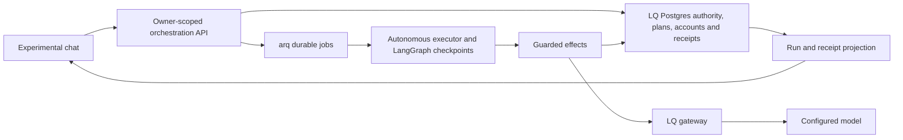

# ADR 0035: bounded chat demonstration plan

**Status:** Implemented on main via PR #631; UAT and evidence are tracked in the
[UAT runbook](../runbooks/adr35-chat-uat.md). Human acceptance remains a separate
gate from automated or agent-executed testing. The design steps below record the
original implementation plan; the runbook describes current behavior.
**Date:** 2026-09-27. **Baseline inspected:** `ce57d6fa3`.
**Tracks:** [#563](https://github.com/LegalQuants/lq-ai/issues/563),
[ADR 0035](../adr/0035-governed-orchestration-run-tree.md), and the
[feature PRD](../prds/issue-563-governed-orchestration.md).

UAT implementation detail: the model adapter accepts raw JSON or one complete
outer `json` Markdown fence. It removes only that presentation wrapper before
the existing strict parser; it does not extract embedded JSON, repair fields,
accept surrounding prose or relax the task schema. The original response and
charge remain in the effect receipt. No additional model call is used.

Build a small experimental chat in which an owner selects an orchestrator, asks
for work, reviews an LLM-proposed plan, approves it, watches separate child
sessions execute, and receives an LLM synthesis in the same conversation. Keep
the existing autonomous executor as the backend and preserve the isolation that
made the first preview safe to explore.

At least one child must apply an existing installed skill to its assigned work.
The demonstration is incomplete without visible skill identity, an actual
skill-backed model call and the resulting work reaching the root synthesis.

This demonstrates the core orchestration decisions in ADR 0035 with actual model
calls. It does not establish completion of every optional capability or the
ADR's production release conditions.

## What the first delivery got right

The [existing workflow preview](issue-563-demonstration.md) established useful
infrastructure: explicit opt-in, immutable approval, a bounded run tree, parallel
child sessions, durable scheduling/checkpoints, retained working files, effect
receipts, budget accounting, halt and partial outcomes. Keeping it away from
ordinary work was an appropriate experimental boundary.

The limitation is the experience and the evidence: the owner supplies topics;
`prepare_demo_plan` constructs the tasks; `SampleGateway` produces findings and
synthesis. The recorded preview establishes workflow mechanics, not model-led
planning or research. Describe that recording as a **workflow preview**.

## First demonstration: concrete scope

Implemented UI: a dedicated **Orchestration chat — experimental** page, reached
from Autonomous sessions at `/lq-ai/autonomous/orchestration/chat`, with an
owner-only run URL for reopening.
Its location does not determine its interaction model: the work starts and ends
in a conversation. Ordinary LQ.AI chat integration is a later increment.

Use a dedicated development/demo deployment with a seeded, owned active demo
project and an installed fictional source packet containing one complete vendor
agreement with numbered clauses on payment, implementation, support, renewal and
termination. This fits the existing
[Contract QA skill](../../skills/contract-qa/SKILL.md), which answers specific
questions about a single contract, including pasted text. The user asks:

> Explain our payment obligations, the implementation and support commitments,
> and how renewal and termination work in this fictional vendor agreement.
> Divide the questions into independent assessments, then combine the answers
> and highlight missing information.

The packet is fixed input; the task decomposition, child findings and synthesis
come from the configured model. A second goal, such as focusing on notice
obligations and what survives termination, must produce a new model proposal and
fresh analysis.
Packet references help inspection but do not constitute citation verification.

The recorded run must include a child applying Contract QA to renewal and
termination questions. For the smallest implementation, bind all question-answering
children to this same installed skill; each still has a separate task, context
and result. The server pins the skill rather than adding dynamic skill discovery.

| Choice | Bound for this increment |
|---|---|
| Orchestrator selection | One installed, pinned, operator-approved orchestration profile shown in a selector; no arbitrary skill selection. |
| Model | One explicitly configured direct provider/model route through the LQ gateway for planning, children and synthesis. No implicit provider fallback. |
| Inputs | Bounded user goal plus the selected immutable fictional packet; server records packet version/hash. Empty document and live-source selections. |
| Project | Server-allowlisted demo project owned by the user, active, with existing autonomous opt-in required. |
| Delegation | One batch of one to four children, one level; default two concurrent children and explicit deployment capacity. The filmed example requests at least two independent tasks. |
| Child skill use | Required: at least one child applies installed `contract-qa` (currently version 1.0.0), pinned by artifact digest. This profile may bind every child to it; tasks must remain specific questions about the one fictional agreement. |
| Calls | One planning call, one analysis call per child, at most one synthesis call. No automatic model repair/retry loop. |
| Budget | Operator-configured accounted cap and explicit token/input limits; planning and finishing allowances reserved before child allocations. Refuse unavailable pricing, including an unpriced local route. |
| Time | Retain the one-hour root deadline; use a disclosed, bounded call timeout suitable for the configured model. Waiting for approval consumes deadline time. |
| Conversation | One request, one proposed plan, explicit approval/rejection, progress and final result per run. After rejection, the owner can edit the request and start a new run. |
| Tools | Required inference and run-file operations only. No live retrieval, attachments, MCP, notifications, KB publication, memory mutation, persistent skill storage or helper execution. |

The packet and isolation are scope controls, not a claim that free text can be
automatically classified as non-confidential. Use fictional goals in a dedicated
demo environment; validate project/skill inference restrictions and gateway
anonymization requirements even there. Enabling arbitrary real projects or
documents remains a separate delivery.

## What the owner experiences

1. Open the experimental chat, select the orchestrator and inspect the fictional
   packet. See the configured model, input scope, total cap and the maximum
   planning spend before sending the request.
2. Select **Propose plan**. This authorizes only the disclosed planning call.
   The conversation shows a durable planning state; no child can start yet.
3. Receive a model-generated plan card: each task's question, boundaries, output
   contract and stopping condition, plus server-selected resources, skill
   version, route, budgets, concurrency, deadline and spend already incurred.
   Each child card names its assigned skill; the renewal/termination child shows
   **Contract QA**, its pinned version and the selected fictional agreement.
4. Select **Approve plan** or **Reject plan**. Approval names the exact revision
   and hash. A request in prose to “start now” cannot bypass the control.
5. Watch child cards change independently. Open a child to inspect its assigned
   task, outcome, run files and receipts. Retain a visible **Halt** control.
   Open the Contract QA child's answer to see its clause quotes and references,
   along with the recorded skill identity and model-call receipt.
6. Read the root synthesis in the same conversation, including completed,
   empty and failed work. Display **Model-generated from fictional inputs;
   unverified**. Halt displays retained results without a new synthesis call.
7. Reload or reopen the run URL and recover the conversation from stored state.
   Closing the browser does not stop an approved run.

No editable plan, mid-run redirection, follow-up conversation or replanning loop
is required for this slice. Rejection retains the planning charge and receipt.
Changed authority, scope or skill invalidates approval; this UI can require a
new run rather than introduce a plan editor.

## Reuse and missing connections

| Existing code | Reuse and required change |
|---|---|
| [Contracts](../../api/app/autonomous/orchestration/contracts.py) | Reuse `ResearchProposal`, `parse_research_proposal`, server-built `PreparedPlan` and approval hashes. Only task data may come from the model. |
| [Store](../../api/app/autonomous/orchestration/store.py) and [models](../../api/app/models/orchestration.py) | Reuse admissions, accounts, fenced effects, receipts and outcomes. Add a genuine planning lifecycle before a prepared plan exists. |
| [Guarded effects](../../api/app/autonomous/orchestration/effects.py), [inference binding](../../api/app/autonomous/orchestration/inference.py), [policy](../../api/app/autonomous/orchestration/policy.py) | Reuse pinned prompts, direct routing, pricing and current-policy checks. Wire these into an enabled model profile, including planning. |
| [Executor](../../api/app/autonomous/orchestration/executor.py) | Reuse fan-out/join and explicit immutable child-file handoff. Add profile-specific operations/prompts; existing operations and messages are sample-specific. |
| [Service](../../api/app/autonomous/orchestration/service.py), [worker](../../api/app/workers/orchestration_worker.py), [worker startup](../../api/app/workers/arq_setup.py) | Use the model-backed profile with the same execution-state owner and shared capacity. The sample-only profile was retired. |
| [API](../../api/app/api/orchestration.py), [read views](../../api/app/autonomous/orchestration/views.py), [web client](../../web/src/lib/lq-ai/api/orchestration.ts) | Add model-profile intake and planning read states; extend receipts with safe inference provenance. Reuse owner-only approve/reject/halt operations. |
| [Chat UI](../../web/src/lib/lq-ai/components/OrchestrationChat.svelte) | Present plan, progress, receipts and bounded polling in a compact conversation. The old preview route was removed. |

The [LQ.AI chat wrapper](../../web/src/routes/lq-ai/chats/+page.svelte) mounts
`ChatPanel`. The separate
[Open WebUI subagent backend](../../web/backend/open_webui/utils/subagents.py)
is not the governed executor. Connecting that delegation loop would introduce
a second execution path; it is outside this plan. Likewise, simply selecting
the current `orchestrator-harness` skill in ordinary chat cannot establish
governed child execution.

## Backend design and critical path

### Planning before approval

This is the largest backend change. Today `PreparedPlan` requires at least one
child; roots require a current plan revision; `execution_view` requires durable
approval; the root graph begins with delegation. Calling the existing inference
adapter from the form is insufficient.

Add a strict server-built `PlanningSnapshot` containing root/owner/project
identity, goal, profile and skill pins, packet identity, resource exclusions,
current policy/route, deadline, total cap and planning/finishing allowances.
Persist it before queueing the planning invocation. Extend the existing root
schema to represent `planning` without a prepared revision; update its status
constraints, active-owner index and read projection accordingly. Keep prepared
plan requirements intact for approval and child admission. Since this release
starts from revision 0066, include the final root shape in migration 0067.

Provide narrowly scoped planning claim/admission methods using the same fenced
effect and accounting machinery. This pre-approval authority permits only the
root's bounded `plan` inference against its snapshot. It cannot admit children,
synthesize, retrieve, publish or run optional tools. Preserve existing approval
requirements for all execution after planning.

Commit planning admission, reservation and dispatch intent before the call;
perform gateway I/O outside database transactions. Parse the returned task JSON
with `parse_research_proposal`, then build and validate the executable plan using
server policy. Record the completed effect and charge even when the proposal is
invalid. A valid proposal transitions to `awaiting_approval`; invalid output
becomes a retained planning failure. Neither case silently substitutes topics.
Bind the packet hash, profile version and route/policy identity into the stored
planning snapshot and the executable plan's approval hash. Version the contract
explicitly so existing sample plans remain readable. Approval and child waits
release worker invocations and database transactions.

Use stable request/effect identities so duplicate sends, competing workers and
recovery reuse committed work. A lost or ambiguous provider response retains its
reservation and enters reconciliation, including during planning. Halt,
revocation and deadline checks also apply before approval. Do not bypass the
governance path with a normal chat completion or a placeholder approved plan.

### Model execution and accounting

Add a dedicated pinned root skill covering structured planning and synthesis;
reuse installed `contract-qa` as the substantive child skill. Explicitly allowlist
it for the closed research profile, with the existing restricted grants and
inference policy. Keep a test-only sample harness for deterministic executor
regression tests. The server chooses the root/child
profile and constructs prompts; model fields cannot name agents, grant tools,
select data or change the route/budget.

For each Contract QA assignment, bind `execution.skill` to the installed skill
pin and use `GuardedEffects.infer` with `ToolIntent.run_skill`. Load the actual
`SKILL.md` and supporting reference/example material through `load_pinned_skill`.
Supply the fictional agreement as the `document` input and the model-proposed
question as `question`. This must exercise the skill's question classification,
clause-based answer and missing-information behavior. Loading a generic demo
prompt or adding a skill badge alone does not satisfy acceptance.

Contract QA has an adaptive Markdown answer format. Add a bounded result adapter
that preserves that answer and its clause references inside the child result
and shared findings file, within the single analysis call. Define and validate
the transport envelope separately from the skill's answer format; do not assume
the skill already emits `TopicOutcome` JSON or discard its substantive answer.
Retain empty/refused/failed outcomes honestly. The root must incorporate the
shared answer and preserve its limitations and reference to the child result.
Record skill name, declared version and artifact digest with the child effect;
recheck the pin before execution and refuse missing or changed artifacts.

Pass each child only its approved task and authorized packet content; exclude
conversation history, unrelated project data and sibling notes. Validate the
bounded child output and write/share its immutable findings through the existing
run-file operations. Root synthesis reads explicit child shares. Test these
handoffs against unknown targets, forbidden intents, schema errors, oversized
or malformed/nested JSON, and instruction-like content. Model-generated text
never becomes executable authority.

Use `InferenceRoutes` with the actual gateway client and explicit rates. Verify
configuration revision enforcement across the deployed API/worker/gateway,
current project/skill policy and anonymization behavior before enabling the
profile. The model route and relevant policy identity must be inspectable in
the approved snapshot. Configuration changes cannot silently alter an approved
run; refuse dispatch and require a new approved snapshot when appropriate.

Fund planning and worst-case bounded synthesis first, then the proposed children.
The total of settled charges and reservations remains inside the accounted root
cap at admission. Planning cost carries into the prepared root account exactly
once. If the proposed batch cannot be funded, show the proposal as not runnable;
do not truncate tasks, increase the cap or use another provider automatically.
Preserve the adapter's conservative accounting and visible observed overruns;
this is not a promise about the provider's final invoice.

### API, conversation and enablement

Add an asynchronous intake endpoint (proposed `POST /autonomous/orchestration/
chat-runs`, HTTP 202) accepting the goal, demo project, allowlisted profile and
packet IDs plus a request idempotency key. Resolve executable authority on the
server. Poll the owner-only run view for planning and execution progress.
Retain the existing revision/hash approval contract.

Represent the conversation as a projection of the stored goal, planning result,
approval action, child states and root result. Those records are authoritative;
there is no second scheduler or browser-owned execution state. The first slice
needs no normal-chat thread migration, WebSocket or SSE integration. Extend the
read schema to represent the absence of a plan during planning and expose safe
provider/model, usage, accounting basis and effect status fields. Never put raw
prompts, credentials or provider error bodies into telemetry.

Add a separate disabled-by-default model-demo flag and explicit profile config
in API, worker and deployment templates. The sample flag must retain its
zero-provider-call meaning. Persist each run's profile/runtime version and
dispatch recovery accordingly; sample runs must never resume against a live
provider. Both profiles share the existing active-owner and deployment-capacity
limits. Drain active runs before incompatible graph/runtime changes, or provide
a reviewed migration. Disabling execution preserves read/halt access and the
existing documented retained-run behavior.

## Ordered implementation slices

| Slice | Deliverable and completion evidence | Depends on |
|---|---|---|
| 1. Pin the demo contract | Add the fictional agreement packet, root skill contract and disabled profile configuration. Pin and allowlist existing Contract QA for child work; define its input/output adapter and provenance fields. Document exact input/call limits and API/read shapes. Sample behavior remains unchanged. | This scope decision |
| 2. Add durable planning | Migrate pre-plan root state; implement planning reservations, guarded model call, strict proposal validation and promotion into an approvable plan. Prove no child can start before approval and planning spend survives failure/restart. | 1 |
| 3. Run the approved model batch | Wire actual gateway inference into skill-backed child analysis and root synthesis, preserving run-file handoff, policy checks, cost and effect recovery. Prove that installed Contract QA receives the approved question/document and its answer reaches synthesis through the real queue/database/gateway. | 2 |
| 4. Add the experimental chat | Build selector, composer, plan approval card, child progress, halt, result and receipt inspection. Show each child's skill/version before approval and its skill receipt with the answer. Reopening reconstructs the run. Browser checks cover pending, rejected, failed and completed states. | 2–3 |
| 5. Establish acceptance evidence | Exercise races, interruption, halt, budgets, data isolation and opt-out; perform an unmocked model smoke run and capture its receipts. Existing sample preview regressions pass. | 3–4 |
| 6. Record and describe the demonstration | Film the complete flow, save the evidence manifest, and update feature/release/operator documentation to the capability actually observed. Keep the earlier video's workflow-preview label. | 5 |

Each slice may be split into smaller PRs. The planning migration and its tests
are the critical path; calendar estimates should follow that design review.
Mocked UI development can proceed against the agreed read schema, but it is not
completion evidence for slices 3 or 5.

## Acceptance and recording checklist

| Demonstrated property | Required evidence |
|---|---|
| Model proposes the work | Natural-language request becomes one to four structured tasks through an actual gateway/model call. Planning receipt identifies the route and spend. No topics entered by the presenter. |
| Approval is a barrier | Provider/admission records show zero child calls before exact-revision approval; rejection, stale approval, double approval and revocation tests preserve the barrier. Planning spend is separately visible. |
| Children execute independently | Distinct child IDs, contexts and receipts; recorded start/finish timestamps show two overlapping executions within capacity. Child output reflects the packet and assigned task. |
| A child uses an installed skill | At least one completed child uses the actual pinned Contract QA instructions and supporting material through a `run_skill` model call. The approved plan and receipt identify its name/version/digest; input mapping, clause-based answer and root consumption are inspectable. Missing, changed or unapproved skill artifacts refuse execution. |
| Root returns their results | Synthesis consumes explicit immutable child shares; each topic remains represented, including empty/failed outcomes. Evidence status stays unverified. |
| Stop and recover work | Separate halt and restart exercises retain outputs; halt admits no new effects or synthesis, although an already-admitted call may finish. Completed effects are reused; uncertain effects are not automatically repeated. |
| Limits survive model output | Invalid proposals, authority-bearing fields, injection-like handoffs, oversized outputs, unknown pricing, policy changes and insufficient budgets fail through the governed path. |
| Experiment stays bounded | Requests for other projects, documents, live sources and optional tools are refused server-side; disabled profile blocks new execution while owner inspection/halt works. |
| Reload is honest | Reopen the URL during planning, approval wait and execution; state and final result come from persisted records. No fabricated progress messages. |

Extend the existing Postgres orchestration suites for contracts, policy,
inference, store, executor, deadlines, recovery and API behavior. Exercise the
actual arq worker and gateway revision contract. Add frontend state/API tests and
run `npm run check:lq-ai`. No Cypress/browser test was added for the chat flow;
browser verification was manual, per the [UAT runbook](../runbooks/adr35-chat-uat.md).
Controlled-provider tests establish reproducible failures; a separate opt-in
unmocked run establishes that a real model performed the work. Both are needed.

For the main recording, show selection/request, the generated plan, the approval
pause, concurrent children, the Contract QA assignment and its clause-based
answer, and the returned synthesis using that answer with receipts. Record
halt/partial results as a separate short run. Save commit
SHA, configuration/profile version, packet hash, skill pins, provider/model,
root/child IDs, timestamps, token usage, charges/reservations and the observed
outcome with the recording. Keep provider secrets out of the evidence packet.

Passing means the unmocked flow works end to end, at least one child demonstrably
applies the installed skill, and the failure/recovery tests hold. Tests must check
that the loaded artifact enters the actual model request and that the preserved
answer enters root synthesis. A polished recording alone cannot discharge the
governance criteria.

## Follow-ons and claims

After acceptance, the supported description is: **Experimental chat-driven
orchestration with model-proposed plans, owner approval, parallel model-backed
child sessions applying an installed skill, and retained results, demonstrated
on fictional inputs.**

Persistent skill workspace reuse and installed bundled helpers remain optional
capabilities demonstrated separately. A later workspace demonstration should
show two invocations reusing an explicit saved revision. A helper demonstration
requires the ADR's executable security review and confidentiality acceptance;
this plan does not waive those requirements.

Real matter documents, KB/live retrieval and normal-chat integration follow
separately. Complete selected-document authorization, project-policy propagation
and the applicable DE-294 acceptance before claiming real matter orchestration.
This bounded profile still needs the cross-agent handoff tests above; excluding
real documents is not a reason to omit them. Runtime adoption under #524 and
production enablement remain their existing review gates.

The chosen trade-off is deliberate: a separate conversational page and fixed
packet constrain integration effort while proving the missing model-driven
workflow. Revisit ordinary chat embedding, richer sources, plan revision and
multiple profiles only after this evidence exists.
