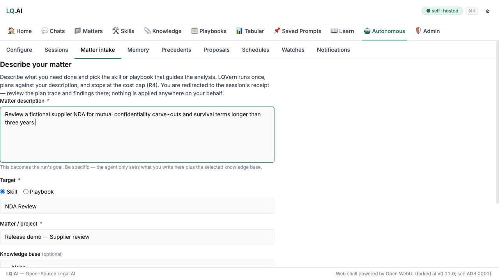
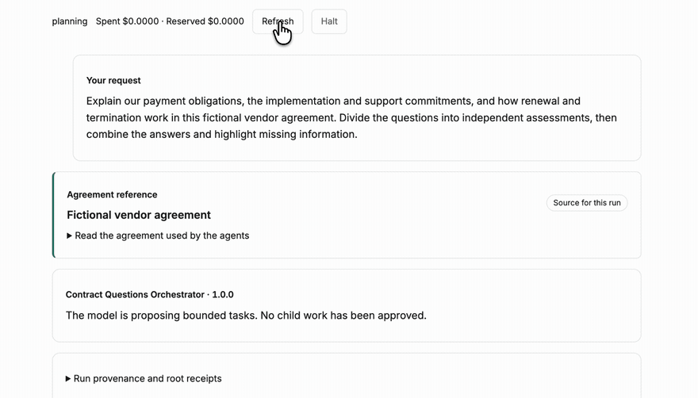

# v0.8.0 — the snapshot-first RustFS migration, matter intake, and release hardening

> **Status: preparation draft; do not tag yet.** The API, gateway, generated OpenAPI export, and
> desktop package versions are prepared at `0.8.0`. Two hands-on migration rehearsals still need
> committed receipts, and the required checks must run on the final release commit. See *Release
> readiness*.

This is a **minor release** under ADR 0025 because an existing bundled-store installation needs an
operator-led migration before the new image starts. Across the 46 merged PRs since `v0.7.1`, the
main story is making consequential operations visible: the object-store move has a snapshot and
rollback path, provider failures stop looking like empty successes, and matter intake opens a
governed autonomous session. An experimental orchestration chat now lets a model propose a plan
for approval before separate child agents work on a fictional agreement. The release also tightens
the checks that build and exercise what gets published.

---

## Headline — migrate the bundled object store before starting RustFS (#594)

The bundled MinIO image is replaced by digest-pinned RustFS 1.0.0. The application still speaks to
an S3-compatible store; this changes the bundled deployment and its on-disk data. ADRs 0036–0037
add a deployment-operations journal, migration `0001`, snapshot receipts, verification, and
snapshot-backed rollback. A code revert alone cannot restore migrated data.

**Existing Compose and desktop installations need a snapshot-first migration.** Take a separate
`pg_dump`, retain the old MinIO image, allow space for the volume snapshot, and keep the generated
snapshot for at least one release cycle. Do not run `docker compose down -v`. The
[MinIO-to-RustFS runbook](../runbooks/minio-to-rustfs.md) gives the exact `plan → apply → up → verify`
sequence, rollback commands, and the Helm, external-store, and multi-drive paths. A deployment using
an external S3-compatible store needs no bundled-volume migration. *(#594, #583)*

The old macOS app carries the obsolete MinIO Compose definition and cannot drive this migration;
install the new launcher first. Existing `MINIO_*` settings and the `minio` network alias remain
accepted through at least v0.10.0, with ADR 0036 retaining them for the rest of 0.x, so an
immediate `.env` rename is unnecessary. New installations should use `OBJECT_STORE_*`; RustFS-native
`RUSTFS_*` names remain inside the container manifest. *(#594)*

---

## Other changes to read before upgrading

- **Required skill inputs now reach their declared contract.** Direct API callers that omit one get
  `400 skill_input_missing`; the web composer already supplies them. The enhance-prompt path supplies
  its own `raw_input` and keeps its provenance marker out of ordinary skill assembly. *(#570)*
- **Chat tool confirmation needs `LQ_AI_MCP_MASTER_KEY` for new pending calls.** The pending payload
  is encrypted at rest; writes fail closed without the key, and a missing or wrong key denies resume
  with `409`. Older plaintext pending rows remain readable until their short TTL expires. Configure
  and retain the key before using this path. *(#403)*
- **Anthropic's omitted output limit rises from 4,096 to 16,384 tokens.** A provider
  `default_max_tokens` overrides it, and an explicit request limit still wins. Invalid provider
  defaults stop startup with a named error. Set the provider default if the earlier ceiling matters
  to a deployment. *(#317)*
- **Adapter timeouts default to 600 seconds** for Anthropic, OpenAI/Azure, and Ollama; a provider
  `timeout_s` overrides the default. A timeout is reported as `client_timeout` rather than as an
  apparent provider outage. Chat history also defaults to 64,000 tokens, preserving more of a large
  attachment for the next turn. *(#318, #504)*

---

## Governed work, with an explicit demonstration boundary

A new matter-intake page starts a governed autonomous session from a description, an owned project,
and a chosen skill or playbook, then opens its trace and receipt. Existing query-less API calls still
work. *(#410)*

The experimental **Orchestration chat** under Autonomous sessions replaces the earlier sample-only
preview. The owner asks a question about one fictional vendor agreement. A configured model proposes
one to four bounded tasks; the owner reviews and approves the exact plan before separate Contract QA
children run. The root model combines their retained findings in the same conversation. Plans,
approval, child receipts, and working files remain inspectable. The demonstration uses a direct model
route but no live sources or real matter documents; answers are unverified. *(#596, #631)*

[Watch the full 68-second demonstration](assets/v0.8.0/orchestration-chat-demo.mp4), including the
child results and combined answer. The recording uses a local model and a fictional agreement.

The chat is **off by default**. To try it, configure a dedicated demo project, a priced direct model
route, the installed skills, and `LQ_AI_ORCHESTRATION_CHAT_ENABLED=true` on the API and arq worker.
The [ADR 0035 chat UAT runbook](../runbooks/adr35-chat-uat.md) has the setup and limits. Turning the
flag off prevents new planning and approval while retained runs remain readable and haltable.
Persistent skill workspaces and bundled helpers have separate gates and are not exercised by this
chat. Children are governed application runs inside the shared worker, not isolated processes.
*(#631)*

---

## Correctness and user-facing fixes

- A provider stream that yields no content now reports a typed failure, records a failed routing
  row, and does not persist an empty successful assistant turn. Anthropic streamed tool-input
  fragments are assembled into compatible tool-call deltas. *(#504, #395)*
- Schedule, watch, and manual autonomous runs reject missing or unowned playbook and knowledge-base
  references before saving them. Artifact emission checks target-KB ownership again before upload,
  so a rejected target leaves no orphan object. *(#411, #569)*
- Multiple artifact-storage failures are combined into one useful warning while each attempt keeps
  its audit row. Gateway tool-choice mappings are documented and pinned by tests. *(#414, #394)*
- Per-chat model selections now survive a browser refresh, with a fallback when the saved model is
  unavailable. The **System** theme now falls back to light instead of taking the operating system's
  dark preference into LQ.AI's partial dark styling. *(#264, #280)*

---

## Test and release pipeline

- The deterministic Cypress track runs nightly against the Compose stack without live provider
  keys. It prepares SvelteKit before launch, bounds a stalled step, and keeps failure diagnostics.
  *(#432, #602)*
- CI enforces an 80% API coverage floor and an 88% gateway ratchet. API pytest runs in parallel with
  worker-local databases and a lockfile-keyed uv download cache. *(#433, #561)*
- Stack smoke runs for deployment-operations changes and probes dependencies imported only on first
  use. CI also builds reviewed helper images and runs their acceptance checks. *(#594, #600, #596)*
- The release-image check catches missing community skill manifests. Image builds and attestations
  now run in an isolated reusable workflow; Dockerfile bases and release-Compose stock images use
  pinned digests. The web image skips an unused ONNX CUDA download. *(#537, #598, #603, #595)*
- Pinned GitHub Actions were refreshed for Python and Node setup, artifact upload, caching, image
  builds, and the grouped Actions updates. *(#547, #548, #549, #606, #607, #608)*

---

## Documentation and maintenance

Reference reverse-proxy overlays now cover Caddy, Traefik, and nginx, and the Slack and Teams bridge
examples use their correct public callback paths. The test strategy maps suites to product surfaces.
ADRs 0027, 0028, and 0035–0037 record the request-budget, documentation-site, orchestration, and
migration decisions; a documentation-site mini-PRD defines the planned journeys and work items.
Fourteen already-implemented roadmap rows now point to their completion evidence.
*(#429, #568, #431, #573, #580, #567, #583, #511, #404)*

Dependency maintenance refreshed the web build base, Compose pgvector digest, API and gateway
groups, typing stubs, and workflow action pins. These updates are included in the range but do not
change the operator steps above. *(#613, #612, #610, #609, #557, #555, #547–#549, #606–#608)*

---

## Who built this release

**Four people have their first author or co-author credit on `main` in this range.**

| Contributor | What they landed |
|---|---|
| [@dropthejase](https://github.com/dropthejase) | per-chat model selection that survives a refresh *(#264)* |
| [@iris-ng](https://github.com/iris-ng) | co-authored the documentation-site mini-PRD *(#511)* |
| [@nanparth](https://github.com/nanparth) | digest-pinned Docker bases and Dependabot image updates *(#603)* |
| [@Shahlawyers](https://github.com/Shahlawyers) | deferred-import probes in stack smoke *(#600)* |

**Four contributors returned.** [@SaifAlYounan](https://github.com/SaifAlYounan) built the matter
intake, ownership checks, encrypted tool confirmation, streaming fixes, and coverage and Cypress
gates *(#410, #411, #403, #504, #395, #433, #432)*.
[@sergiomaldo](https://github.com/sergiomaldo) worked on Anthropic output and timeout behavior and
the release-image skill check *(#317, #318, #537)*. [@sgbooth](https://github.com/sgbooth)
fixed the System-theme fallback *(#280)*, and [@ThurgyThurg](https://github.com/ThurgyThurg)
parallelized API tests and added the uv cache *(#561)*.

Maintainer work by [@houfu](https://github.com/houfu) includes the RustFS migration, skill-input
enforcement, the target-KB ownership check, the governed run tree and model-backed orchestration
chat, the reusable release-image workflow, and the Cypress startup repair
*(#594, #570, #569, #596, #631, #598, #602)*.
Dependabot supplied the dependency, image, and workflow-action updates.
That is nine human contributors in this release, four appearing in the `main` history for the first
time.

---

## Schema

The API's Alembic head moves from **0066 to 0068**. Migration **0067** adds the orchestration run
tree and durable model-planning state, backfills existing autonomous sessions, and adds indexes and
a trigger; on a populated database, allow for a one-time write and table lock. Migration **0068**
adds optional skill workspaces. Both migrations apply even while the orchestration chat flag is off.
The object-store migration is separate: its `0001`
and receipts live in the deployment-operations journal, not the application database. *(#596, #594)*

---

## Version

**v0.8.0 is the release version.** The bundled-store migration requires operator action, so ADR
0025 makes this a minor release over `v0.7.1`. The API and gateway `__version__` values, the API
version in the committed OpenAPI export, and the desktop package and lockfile are set to `0.8.0`.
`web/package.json` remains `0.11.0`, the OpenWebUI fork version, rather than taking the image tag.

The desktop launcher has its own `desktop-v0.8.0` tag. Its build derives the image tag it bundles
from that desktop tag, and it must follow the published and verified `v0.8.0` image set. *(#594)*

---

## Honest scope

The orchestration chat is model-backed, fictional-input-only, and off by default; enabling it does
not turn the shared arq worker into a network-isolated process or grant access to real matter
documents. The migration runbook covers an existing bundled store; external S3-compatible stores
follow their own deployment path. The current branch prepares
release files and notes. It does not include the two hands-on rehearsal receipts required for the
tag, nor does a green workflow replace verification of published images and the desktop artifact.

---

## Release readiness

**Prepared:** the API, gateway, generated OpenAPI, and desktop package and lockfile versions agree
at `0.8.0`; this note points to the migration runbook. The release branch is based on
`legalquants/main` at `e9832b18d`. Refresh the range if more changes merge before the cut.

**Before tagging:** commit receipts for the ADR 0036 rehearsal of a long-lived MinIO volume with
soft-deleted files and export bundles, and for the signed Apple Silicon launcher migration. Run the
required API, gateway, web, stack-smoke, and version checks on the final release commit.

**Cut order (maintainer):**

1. Merge the completed release preparation and rehearsal evidence to `legalquants/main`.
2. Create the annotated `v0.8.0` tag on that merge commit. Verify the published image set, its SBOMs,
   and each image's `build-image.yml` provenance signer before proceeding.
3. Create `desktop-v0.8.0` only after those images are available. Download the published DMG and
   verify both its Developer ID signature and notarization staple.

---

*Drafted from `v0.7.1..legalquants/main` at `e9832b18d` (46 merged PRs), plus the local release
preparation. Versioning and cut order follow ADR 0025 and `docs/BUILD-AND-RELEASE.md`; migration
steps and rehearsal requirements follow ADR 0036 and the linked runbook.*
