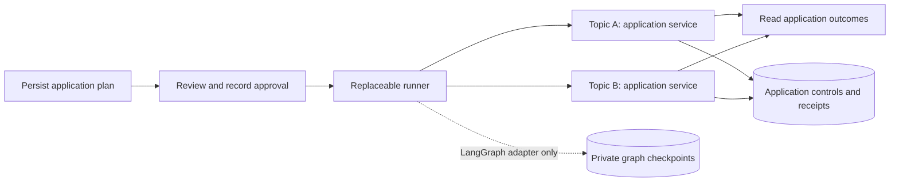

# Issue 563: disposable execution integration

Implemented on 12 September 2026 following Houfu's request to try the small integration before upgrading the application. **The replaceable adapter boundary works for this fixed research batch. The experiment does not yet establish that LangGraph is the best production coordinator.**

Everything here is isolated under `outputs/issue-563-spike`. The application's source, manifests, lockfiles and database are unchanged. This is a local Python fixture with stub searches, not a shipped feature or an integration with LQ's real guard. The original implementation plan remains subject to review.

## LangGraph 1.0 comparison

At Houfu's request, the prototype now pins **LangGraph 1.0.10**, the latest published patch in the 1.0 line observed on 12 September 2026. It previously used 1.2.11. **No Python implementation or test changes were needed, and no behavior difference was observed in the existing 23-test suite.** Ruff lint/format and strict mypy also pass. File hashes confirm the Python sources are unchanged from the 1.2.11 baseline.

Only three resolved package versions changed; no packages were added or removed:

| Package | Previous | Current |
|---|---|---|
| LangGraph | 1.2.11 | 1.0.10 |
| LangGraph prebuilt | 1.1.0 | 1.0.13 |
| LangGraph SDK | 0.4.4 | 0.3.15 |

Core 1.6.3, checkpoint 4.2.0 and SQLite saver 3.1.1 remain unchanged. This tests the 1.0 runtime with those current companion packages, not the dependency set shipped when 1.0.0 first appeared. LangGraph 1.0.10 requires prebuilt below 1.1 and SDK below 0.4. [Published dependency metadata](https://pypi.org/pypi/langgraph/1.0.10/json).

Two additional cross-version checks created data with 1.2.11 and resumed it with 1.0.10: a run paused for approval, and a run killed after its first application receipt committed. Both finished with exactly one recorded provider call per topic. These are checks of this fixture's checkpoint schema and retained saver versions, not a general guarantee of downgrade compatibility.

There is a maintenance tradeoff despite the functional match. The required SDK 0.3.15 falls within the affected range of the resource-authorization decorator advisory fixed in SDK 0.4.4. This local prototype does not use those decorators or run an Agent Server, so that affected feature is not exercised. The older pin should not be promoted as a fully patched production baseline on the strength of these tests. [Upstream advisory and affected feature](https://github.com/langchain-ai/langgraph/security/advisories/GHSA-fvww-7h3r-vfhp).

The architecture finding is unchanged: the narrow adapter works on both tested runtimes, but this fixed batch does not demonstrate a LangGraph code-saving advantage. Moving to 1.0 also does not remove the framework's transitive dependency family.

## What runs

A fixed two-topic research plan is stored as ordinary JSON. The first invocation returns the plan for review and exits with `awaiting_approval`, making no search calls. A separate approval operation records its exact digest. The next invocation runs the topics concurrently and returns their individual outcomes. Empty strings are successful search results.



The two adapters implement the same `tick(run_id) -> RunView` contract:

| File | Responsibility | Physical lines, including comments/blanks |
|---|---|---:|
| [core.py](core.py) | Plain contracts, immutable plan, approval digest, current source/document checks, integer call allowance and durable effect receipts | 263 |
| [langgraph_adapter.py](langgraph_adapter.py) | `StateGraph`, approval interrupt/resume, `Send` fan-out, join, SQLite saver, graph version and resume handling | 115 |
| [native_adapter.py](native_adapter.py) | A fixed batch using `asyncio.gather` and a semaphore; reconstructs remaining work from effect receipts | 24 |
| [demo.py](demo.py) | Command-line demonstration, recording stub provider and explicit process-crash injection | See source |

All five LangGraph/LangChain import statements are confined to the LangGraph adapter. Neither task contracts nor the search callable accepts a graph state, `Command`, `RunnableConfig`, LangChain message, or tool decorator. Graph checkpoints contain identifiers/digests, version markers and framework continuation data; business results and current permissions remain in the application database.

The native adapter is intentionally limited to one immutable batch with one effect per topic. Its smaller size is **not** a comparison with a production Postgres/arq engine or a durable multi-step agent loop.

## Evidence from execution

**23 tests passed.** Ruff lint/format and strict mypy passed for all four implementation modules. Tests use real compiled LangGraph execution, file-backed SQLite databases and separate Python processes. The parallelism assertion uses a barrier: two searches must enter before either can finish. It does not infer overlap from elapsed time.

| Check | Observed result |
|---|---|
| Approval and process restart | Both runners remain paused across new processes; no provider calls precede approval. |
| Stale/duplicate approval | A wrong digest is rejected. Repeating approval or execution does not duplicate recorded searches. |
| Parallel children and empty output | Two searches overlap, receive their assigned topic/scope and complete with empty strings. |
| Current controls after pause | Halt and revoked source access block invocation; a one-call allowance admits only one child. |
| Halt during work | In a four-topic fixture, two calls overlap; halt during that first wave prevents calls for the remaining two. |
| Completed effect, unfinished graph step | A process exits with code 73 immediately after topic A's application receipt commits. Restart completes topic B without repeating A. |
| Unknown external outcome | A process exits with code 74 after the stub provider records a call but before the application receipt. Restart exposes `uncertain` and does not repeat that call. |
| Backend replacement | All four combinations of original/replacement runner recover the completion-crash fixture, including LangGraph → native. |
| No framework required for native execution | Every native subprocess runs with Python `-S`, disabling third-party site packages. |
| Ordinary fixture failure | The failed topic remains visible and its sibling completes. The root requires attention; no automatic retry or research synthesis occurs. |
| Version changes | Unsupported application contracts and changed graph versions refuse execution/resume explicitly. |

The failure behavior is an **experiment assumption**, not ratification of the product's partial-failure policy. Its purpose is to expose outcomes for inspection.

One useful failure occurred while building the adapter. My initial code assumed an empty `snapshot.next` meant completion. A hard crash left pending checkpoint work and an interrupt task despite that empty list, so a restart stranded topic B. The adapter now checks remaining tasks too and explicitly uses synchronous checkpoint durability. The final crash suite passes. This was an integration mistake, not evidence of a LangGraph defect. Upstream documents the difference between asynchronous and synchronous writes in its [durability modes](https://docs.langchain.com/oss/python/langgraph/checkpointers#durability-modes).

## What this says about dependency and maintenance cost

LangGraph can remain an implementation detail of execution. The successful replacement test is stronger evidence than an interface diagram: the native runner resumes using the same application records without reading a LangGraph checkpoint.

That portability has a boundary. It works because this fixture has one effect per immutable topic. It does not export a suspended multi-step model loop or translate a checkpoint into another runtime. Before replacing such a runtime, we would need to drain its runs, restart from application-owned step boundaries, or explicitly migrate them. A wrapper cannot make arbitrary graph continuations portable.

The application-owned approval and effect receipts were necessary under **both** adapters. LangGraph did not supply the transaction joining authorization, call admission and external effects. It supplied interrupt persistence, scheduling and join machinery. For this small fixed batch, that did not reduce our code count. More complex child loops may change the tradeoff; this experiment does not measure that benefit.

The current isolated lock resolves LangGraph **1.0.10**, Core **1.6.3**, checkpoint **4.2.0**, SQLite saver **3.1.1**, SDK **0.3.15**, prebuilt **1.0.13** and LangSmith **0.12.4**, among other transitive packages. The comparison above records the original 1.2.11 baseline and the SDK tradeoff. Avoiding their application APIs does not avoid maintaining this package family. The fixture uses the explicit serializer allowlist setting `allowed_msgpack_modules=None`, with no pickle fallback, and disables tracing in the CLI and tests. This is configuration exercised by the restart tests, not a comprehensive deserialization or security audit.

**Recommendation for the plan:** retain the narrow adapter boundary, keep LangGraph provisional, and require it to show a concrete reduction in continuation work before making it the foundation of the new harness. Upgrade the three existing application executors under issue 524 as a separate maintenance change after review; that existing dependency debt should not itself decide the new harness architecture. This spike ran first, in its own environment, as requested.

## Limits and next decision gate

Docker was not running, so the spike used SQLite instead of starting or altering the application stack. It assumes one coordinator owns a run at a time. Cutover tests kill the old process before starting a replacement. It does not implement ownership leases, an outbox, queue capacity, cross-worker concurrency limits, actual LQ child sessions, tenant authorization, real cost accounting, or gateway integration. The integer allowance is a call-count fixture, not a dollar budget. The synchronous SQLite operations are short local transactions, not a production async database implementation.

The next production gate remains: verify the selected adapter against the actual LQ guard and Postgres transaction boundaries, including competing coordinators, queue delivery failures and multi-step child recovery. Reuse the acceptance scenarios here; do not promote this SQLite service or maintain both runners as shipping alternatives. No production milestone is marked complete by these tests.

## Reproduce

From this directory, using the local environment already created:

```sh
.venv/bin/pytest -q
.venv/bin/ruff check .
.venv/bin/ruff format --check .
.venv/bin/mypy core.py native_adapter.py langgraph_adapter.py demo.py
```

To recreate the environment, run `uv sync --locked` here. The experiment has its own `pyproject.toml` and `uv.lock`.

Use a fresh directory for each demonstration; `prepare` deliberately refuses to overwrite an existing plan:

```sh
.venv/bin/python demo.py langgraph prepare .demo/review
# Inspect the returned plan; no child has run.
.venv/bin/python demo.py langgraph approve .demo/review
.venv/bin/python demo.py langgraph run .demo/review
```

To demonstrate replacement after a real process crash:

```sh
.venv/bin/python demo.py langgraph prepare .demo/cutover
.venv/bin/python demo.py langgraph approve .demo/cutover
.venv/bin/python demo.py langgraph run .demo/cutover --fault after-receipt
# The preceding command deliberately exits 73.
.venv/bin/python -S demo.py native run .demo/cutover
```

The final command reports both topics complete; the tests additionally inspect the separate stub-provider database to prove each was called once. All data is disposable and confined to the chosen demo directory or pytest's temporary directory. No live research provider is called.
